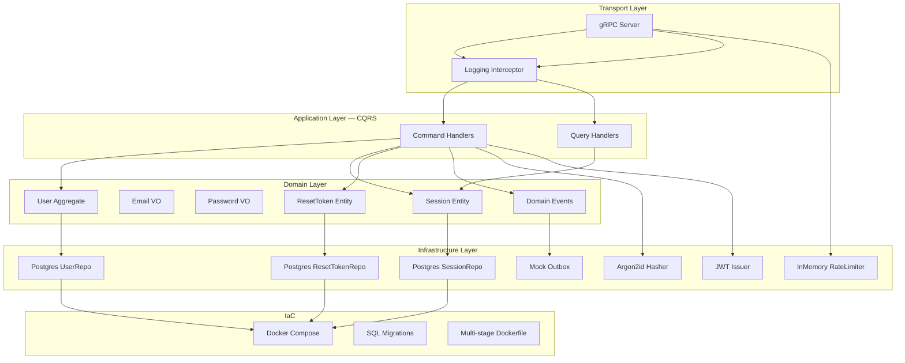

# Auth Service — Engineering Challenge

## Выбор стека и аргументация

**Go** выбран как основной язык по следующим причинам:
- Строгая типизация и компиляция — ошибки ловятся до runtime.
- Отличная поддержка gRPC (grpc-go, protoc-gen-go) — первоклассный стек без прослоек.
- Встроенный тестовый фреймворк, race detector, benchmark — всё из коробки.
- Простая модель конкурентности для rate limiting и graceful shutdown.
- Минимальный runtime, идеален для контейнеров (Alpine + static binary).

**Альтернативы, которые рассматривались:**
- **Rust** — отличная безопасность памяти, но выше порог входа и дольше цикл разработки для challenge.
- **TypeScript/Node** — быстрый старт, но хуже производительность и типизация для domain layer.
- **Java/Kotlin + Spring** — зрелая экосистема DDD, но тяжёлый runtime и boilerplate.

## Как запустить

### Предусловия
- Docker и Docker Compose

### Запуск
```bash
# Поднять всё окружение (PostgreSQL + Redis + migrator + auth-service)
docker compose -f infra/docker-compose.yml up --build -d

# Проверить что миграции прошли
docker compose -f infra/docker-compose.yml logs migrator

# Проверить логи сервиса
docker compose -f infra/docker-compose.yml logs -f auth-service

# Остановить
docker compose -f infra/docker-compose.yml down -v
```

### Порядок запуска
Миграции вынесены в отдельный контейнер `migrator` и **не выполняются внутри auth-service**. Это принципиальное решение: при горизонтальном масштабировании (10+ инстансов) запуск миграций из каждого инстанса — это гонка, потенциальные deadlock'и и dirty state в `schema_migrations`. Мигратор отрабатывает один раз, и только после его успешного завершения (`exit 0`) поднимаются сервисы. В Kubernetes это маппится на `initContainer` или `Job` перед `Deployment`.

### Запуск тестов
```bash
go test -v -count=1 ./...
```

### Проверка через grpcurl
```bash
# Регистрация
grpcurl -plaintext -d '{"email":"user@example.com","password":"password123","password_confirm":"password123"}' \
  localhost:50051 auth.v1.AuthService/Register

# Логин
grpcurl -plaintext -d '{"email":"user@example.com","password":"password123"}' \
  localhost:50051 auth.v1.AuthService/Login

# Обновление токена (подставить refresh_token из Login)
grpcurl -plaintext -d '{"refresh_token":"<REFRESH_TOKEN>"}' \
  localhost:50051 auth.v1.AuthService/RefreshToken

# Logout
grpcurl -plaintext -d '{"session_id":"<SESSION_ID>"}' \
  localhost:50051 auth.v1.AuthService/Logout

# Запрос восстановления пароля
grpcurl -plaintext -d '{"email":"user@example.com"}' \
  localhost:50051 auth.v1.AuthService/RequestPasswordReset

# Подтверждение сброса пароля (подставить token из письма)
grpcurl -plaintext -d '{"token":"<RESET_TOKEN>","new_password":"newpass123","confirm_password":"newpass123"}' \
  localhost:50051 auth.v1.AuthService/ConfirmPasswordReset

# Health check
grpcurl -plaintext localhost:50051 grpc.health.v1.Health/Check
```

## Архитектурная схема



## Где в решении DDD, CQRS и IaC

### DDD

**Bounded Context: Identity** (`internal/identity/`)

Один bounded context, а не два — осознанное решение. Критерии выделения bounded context по Эвансу:

1. **Ubiquitous Language** — слово `User` в регистрации, логине и восстановлении пароля означает одно и то же: владелец учётных данных (email + password hash). Нет расхождения языка — нет границы.
2. **Единый агрегат** — восстановление пароля мутирует `User.PasswordHash`, то есть работает с тем же агрегатом, что и регистрация. Выделение `CredentialRecovery` в отдельный контекст потребовало бы либо дублирования `User`, либо shared kernel, либо синхронного cross-context вызова — всё это искусственная сложность.
3. **Единая политика** — изменение правил валидации пароля затрагивает и регистрацию, и reset одновременно. Общие инварианты = один контекст.

Отдельный bounded context имел бы смысл, если бы recovery шёл через независимый email-verification сервис с собственной моделью (`Recipient`, `VerificationAttempt`) и общался с Identity через события.

| Артефакт | Расположение |
|---|---|
| Bounded Context | `Identity` — аутентификация, учётные данные и их восстановление |
| Агрегаты | `User` (корень), `Session`, `ResetToken` |
| Value Objects | `Email`, `Password` |
| Доменные события | `UserRegistered`, `PasswordResetRequested`, `PasswordResetCompleted` |
| Инварианты | email uniqueness, password >= 8 chars, password confirmation match, reset token one-time + TTL + cooldown |
| Repository ports | `domain/repository.go` — интерфейсы, инфраструктура не просачивается в домен |
| Service ports | `domain/services.go` — `PasswordHasher`, `AccessTokenIssuer` |

### CQRS

| Сторона | Handlers | Что делают |
|---|---|---|
| Command | `RegisterUser`, `LoginUser`, `LogoutUser`, `RefreshToken`, `RequestPasswordReset`, `ConfirmPasswordReset` | Изменяют состояние системы |

В текущем scope все операции — команды (изменяют состояние: создают пользователя, сессию, ротируют токен, сбрасывают пароль). Query side представлен на уровне **отдельных read-интерфейсов** репозиториев (`UserReadRepository`, `SessionReadRepository`, `ResetTokenReadRepository`), что обеспечивает готовность к физическому разделению read/write stores без изменения application-слоя.

### IaC

| Артефакт | Расположение |
|---|---|
| Docker Compose | `infra/docker-compose.yml` — PostgreSQL + Redis + auth-service, healthcheck, volumes |
| Kubernetes | `k8s/` — Deployment, Service, Job, ConfigMap, Secret, NetworkPolicy, PDB, Kustomization |
| Dockerfile | `Dockerfile`, `Dockerfile.migrator` — multi-stage build (builder + alpine) |
| SQL Migrations | `internal/.../postgres/migrations/` — embedded через `go:embed`, выполняются отдельным контейнером `migrator` до старта сервисов |
| Makefile | корень репозитория — `make up`, `make test`, `make proto` |

#### Kubernetes манифесты (`k8s/`)

```
k8s/
├── kustomization.yaml      # Kustomize — single entry point
├── namespace.yaml           # Изоляция namespace auth
├── configmap.yaml           # Не-секретная конфигурация
├── secret.yaml              # DB/Redis credentials (в prod → Sealed Secrets / Vault)
├── postgres.yaml            # ⚠ Только для local/minikube — в prod managed DB
├── redis.yaml               # ⚠ Только для local/minikube — в prod managed Redis
├── migrator-job.yaml        # Job: миграции до деплоя (Helm pre-install hook)
├── auth-deployment.yaml     # 2 реплики, gRPC probes, resource limits, rolling update
├── auth-service.yaml        # ClusterIP Service для gRPC
├── network-policy.yaml      # Zero-trust: только 50051 ingress, только PG/Redis/DNS egress
└── pdb.yaml                 # PodDisruptionBudget: minAvailable=1
```

Запуск на minikube:

```bash
minikube start

# Собрать образы внутри minikube (чтобы не нужен registry)
eval $(minikube docker-env)
docker build -t auth-service:latest -f Dockerfile .
docker build -t auth-migrator:latest -f Dockerfile.migrator .

# Деплой всего стека
kubectl apply -k k8s/

# Проверить статус
kubectl -n auth get pods,jobs,svc

# gRPC запрос через port-forward
kubectl -n auth port-forward svc/auth-service 50051:50051
grpcurl -plaintext localhost:50051 grpc.health.v1.Health/Check
```

> **Production**: удалить `postgres.yaml` и `redis.yaml` из `kustomization.yaml`, заменить DNS в Secret/ConfigMap на managed endpoints (RDS, ElastiCache).

## Бизнес-правила и инварианты (из Figma)

### Авторизация (Login)
- Валидация связки email + password по нажатию кнопки «Войти».
- При несовпадении — `ErrInvalidCredentials` (не раскрываем, что именно неверно).

### Регистрация (Register)
Приоритет ошибок валидации:
1. Email уже занят (`ErrEmailAlreadyTaken`)
2. Недопустимый формат email (`ErrInvalidEmailFormat`)
3. Пароли не совпадают (`ErrPasswordMismatch`)
4. Пароль короче 8 символов (`ErrPasswordTooShort`)

### Восстановление пароля
- **Step 1**: ввод email, валидация по существующему пользователю.
- **Step 2**: «Проверьте почту» — ссылка с reset-token отправляется через mock outbox.
- **Step 3**: новый пароль + подтверждение (совпадение + минимум 8 символов).
- **Step 4**: результат — успех или ошибка с возможностью «Попробовать заново».

### Reset Token Lifecycle
- Криптостойкий токен (32 байта), в БД хранится только SHA-256 hash.
- TTL: 30 минут.
- Одноразовый: после использования помечается `used_at`.
- Cooldown: повторный запрос — не раньше чем через 2 минуты.

## Безопасность

- **Пароли**: Argon2id (memory-hard, timing-safe comparison).
- **Сессии**: refresh token rotation (каждый RefreshToken выдаёт новый refresh + access, старый refresh инвалидируется). Reuse отозванного токена — автоматический revoke всех сессий пользователя (защита от token theft). Revoke по ID или по user.
- **JWT**: ES256 (ECDSA P-256), асимметричная подпись — приватный ключ подписывает, публичный верифицирует. Short-lived (15 min), claims: sub + email. Готово к multi-service: публичный ключ можно раздать потребителям без риска подделки токенов.
- **Rate limiting**: Redis Sliding Window Counter для Login (5/5min) и RequestReset (3/5min). Атомарный Lua-скрипт считает взвешенную сумму запросов из текущего и предыдущего окна, что устраняет проблему 2x burst на стыке окон у Fixed Window. Отклонённые варианты: Fixed Window (burst на границе), Sliding Window Log (O(n) памяти на ключ), Token Bucket (допускает burst by design — нежелательно для auth-операций).
- **Reset tokens**: raw token никогда не сохраняется в БД, только hash. Raw доступен только в mock outbox (логи).
- **Input limits**: пароль 8–72 символа (защита от DoS через Argon2id на длинном input), reset token ≤ 128 символов (отсечка до SHA-256).
- **Error masking**: Login не раскрывает, существует ли пользователь (единое сообщение). Reset token ошибки (not found / expired / used) объединены в generic `"invalid or expired token"` — не позволяют перебирать токены.
- **Internal state protection**: ошибки инфраструктурного слоя не пробрасываются клиенту — `mapDomainError` возвращает generic `"internal server error"` для неизвестных ошибок; user ID и детали БД не фигурируют в gRPC responses.

## Наблюдаемость

- **Structured JSON logs** через `slog` (стандартная библиотека Go 1.21+).
- **gRPC Logging Interceptor**: метод, duration, status code для каждого запроса.
- **Domain events**: публикуются в mock outbox с логированием event name и timestamp.

## Ключевые компромиссы (Trade-offs)

| Решение | Почему | Альтернатива |
|---|---|---|
| Один gRPC сервис без frontend | Фокус на архитектурной зрелости backend | gRPC-Gateway + React SPA |
| Логический CQRS (одна БД) | Достаточно для auth-домена, проще операционно | Отдельные read/write stores + event sourcing |
| Redis rate limiter | Корректен для multi-instance, готов к production | Envoy/Istio rate limiting на infrastructure layer |
| Mock outbox вместо SMTP | Локальная проверяемость без внешней зависимости | MailHog/SES в Docker Compose |
| Argon2id вместо bcrypt | Более устойчив к GPU-атакам | bcrypt (проще, достаточен для большинства случаев) |
| Embedded migrations (golang-migrate) | Версионирование, идемпотентность, rollback, миграции вшиты в бинарник | Flyway, Atlas, ручные SQL-скрипты |

## Следующие шаги для production

1. **Rate limiting на infrastructure layer** — Envoy/Istio rate limiting policy поверх текущего application-level Redis limiter.
2. **Email delivery** — интеграция с SES/SendGrid через transactional outbox pattern.
3. **Event sourcing** — для полного audit trail auth-операций.
4. **Auth interceptor** — gRPC middleware для проверки JWT в metadata на защищённых endpoints.
5. **OpenTelemetry tracing** — distributed tracing через gRPC interceptor.
6. **Prometheus metrics endpoint** — counter/histogram для auth-операций.
7. **Helm chart** — шаблонизация поверх текущих K8s манифестов для управления конфигурацией между окружениями (dev/staging/prod).
8. **Schema evolution governance** — CI-проверка что каждая миграция обратно совместима (expand-contract lint).
9. **Мигратор в shared-модуль** — вынести движок миграций в отдельный Go-модуль (или заменить на Atlas), переиспользовать между сервисами. Каждый сервис поставляет свои SQL-файлы, общий движок — логику выполнения.
10. **MFA (TOTP/WebAuthn)** — второй фактор аутентификации.
11. **Integration tests** — testcontainers для PostgreSQL в CI.
12. **ES256 -> ES512** — при росте вычислительных мощностей переход на P-521 кривую для увеличения запаса прочности (обратная совместимость через `alg` в заголовке JWT).
13. **JWKS endpoint** — раздача публичного ключа через стандартный `.well-known/jwks.json` для автоматической ротации и discovery другими сервисами.

## Тестовое покрытие

| Уровень | Кол-во тестов | Что покрывает |
|---|---|---|
| Domain (value objects) | 17 | Email validation, password policy, reset token lifecycle, session validity |
| Application (command handlers) | 18 | Register, Login, RefreshToken (rotation, reuse detection, revoked session), full Reset flow, error priority |
| Infrastructure | 9 | Argon2id hash/verify, JWT issue/validate, rate limiter |
| **Итого** | **38** | |

```bash
go test -v -count=1 ./...
make lint   # golangci-lint (errcheck, staticcheck, mnd и др.)
```
